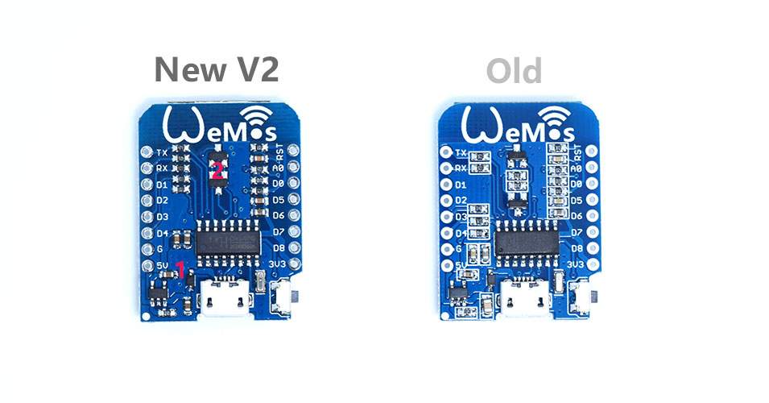
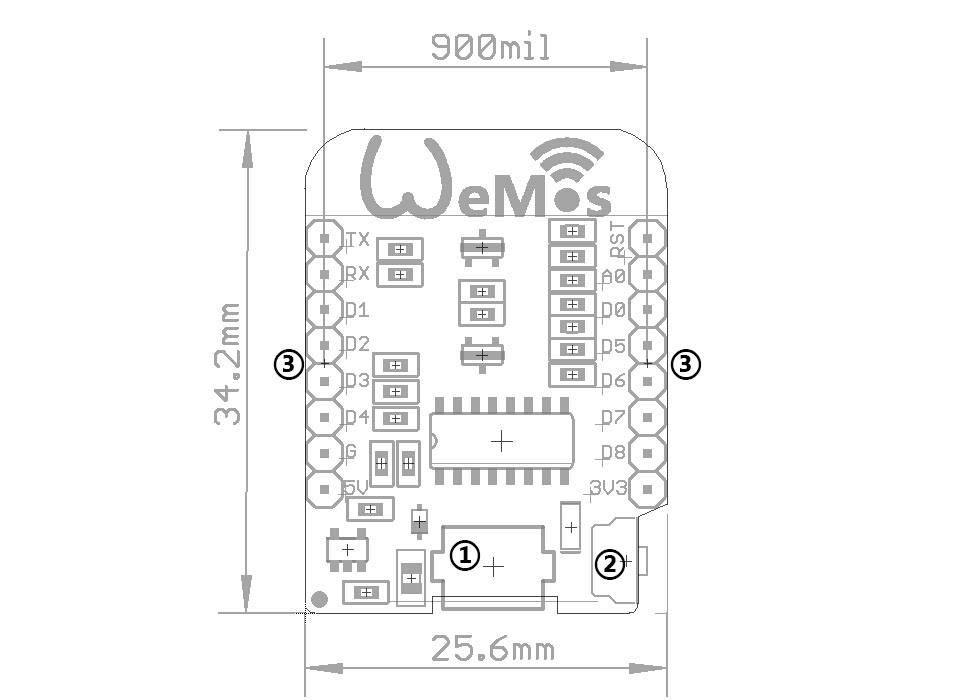

# WeMos_ESP8266

Di WeMos es una placa similar al NodeMCU de tamaño reducido pensado para poder usar de forma sencilla con ona protoboard
El D1 mini es un mini wifi basado en ESP-8266EX.   [Más información](http://www.wemos.cc)

Diferencias entre V1 y V2

Compatible con [el IDE de Arduino](https://github.com/esp8266/Arduino) [Tutorial: getting started with Arduino](http://www.wemos.cc/tutorial/get_started_in_arduino.html) [Getting started with NodeMCU](http://www.wemos.cc/tutorial/get_started_in_nodemcu.html)

Compatible con [nodemcu](http://www.nodemcu.com)

# Conexiones:
* 11 entradas/salidas digitales, todos los pines tienen interrupción/pwm/I2C (excepto D0)
* 1 entradas analógicas (3.2 V de entrada max)
* Una conexión Micro USB

# Dónde comprarla

* [Aliexpress](Compatible conArduino https://github.com/esp8266/Arduino
Compatible connodemcu  http://www.nodemcu.com
)
